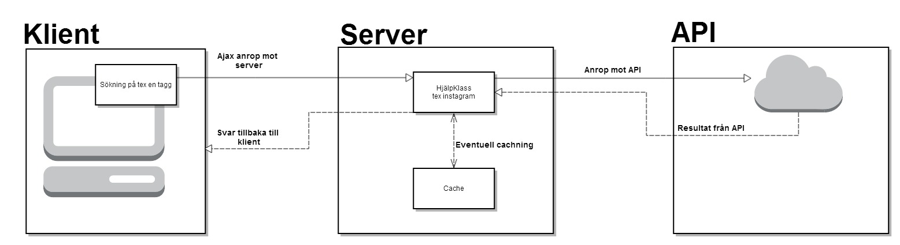

#Rapport för Projekt 1DV449 "TagSearch"

###Inledning 
>Tanken var att göra en mashup applikation med Twitter och Instagram, där man får instagram bilder presenterade beroende på 
senaste trenderna på twitter.

>Från början ville jag ha med mer interaktion med twitter. Men det skulle kräva att användarna skulle vara tvugna att autentsera sig
med både instagram och twitter.

>Då jag inte vill tvinga användarna till att behöva autentisera sig med båda så gjorde jag valet att fokus ligger på Instagram.

>Applikationen fungerar så att användaren blir presenterad med dem senaste trenderna på twitter. Användaren kan sedan välja någon
utav trenderna och få upp ett resultat med instagram bilder som har samma tagg som trenden.
Väljer användaren att logga in med sitt instagram konto så kan användaren även söka på valfri tagg.

>Användaren slipper också till skillnad från oinloggade användare att få ett cachat resultat, Då instagram har ett väldigt aktivt flöde med bilder så får man det allra senaste.

###Schematisk bild 

###Serversida: 

>Jag använder PHP på serversidan, Det är serversidan som gör alla request mot twitter och instagram apierna.

>Serversidan sköter också Cachningen av datan. Twitter trenderna cachas i 10 minuter och instagram resultatetn cachas i 1 min.
Instagram resultatet cachas bara för de request som görs om du inte är inloggad. Det är för att då är det Client_ID som gör alla request, och det ligger en begränsning på 5000 request/H. Är du där emot inloggad så cachas inget, för då har du ett så pass stort antal request tillförfogande. 

>Twitter har en begränsning på 15 request/15 min, och eftersom det är clienten som står för det så cachas det i 10 min innan det kan uppdateras.
>Det är även hårdkodat att trenderna som hämtas är för sverige. Eftersom det är applikationen som står för alla request så kan jag inte erbjuda alla användare att söka trender var dem vill. Sverige som gäller.

>Ifall det skulle bli något fel vid hämtning från apiet så retunerar det error från serversidan, och klientsidan tar hand om det, och visar att inga bilder kunde hittas.

>När jag började med applikationen så började jag med twitter funktionaliteten, Jag ville komma igång snabbt och valde därför att använda "tmhOAuth", en hjälp klass för att sköta inloggning och göra request mot twitter.
>Men när jag började med instagram så ville jag inte ha en färdig skriven kod. Så vad gäller all instagram funktionalitet så är är skrivet för hand.
>Jag hann aldrig skriva om twitter funktionaliteten, så den använder sig fortfarande av "tmhOAuth" klassen. Det är mycket möjligt att jag i framtiden väljer att skriva om den för hand. Men jag anser att det kan vara bra att testa på ett färdig skrivet också.  

###Klientsida: 

>När applikationen initiseras så görs ett ajax anrop mor servern som i sin tur gör ett anrop mot twitter och hämtar hem de senaste trenderna. När klientsidan fått resultatet så renderar den ut de seanste trenderana på sidan, Vilket sköts från Twitter.js.

>Den största funktionaliteten ligger i Instagram.js, den sköter allt som har med instagram funktionaliten på klientsidan att göra.
>När du klickar eller söker på en tagg så görs ett ajax anrop mot serven som retunerar ett resultat med instagram bilder.

>För tillfället så finns det 4 olika anrop som kan ske från Instagram från klient sidan. Göra en sökning på en tagg, ladda fler resultat på samma tagg, Lika och Unlika.
>Dessa anrop kräver lite olika parametrar osv. Men jag har skrivit en funktion som gör ett ajax anrop, men beroende på parametrar så händer olika saker. Från början hade jag en funktion för varje anrop. Men det blev mycket mindre kod när jag skrev om den så den går att använda till alla anrop som görs mot instagram.

>Vad gäller uppdelning av koden på klient sidan så har jag försökt att separera så mycket som möjligt. All html som används i javascript koden har jag försökt att samla i en klass InstagramHTML.js, för det ska vara tydligare och lättare att hantera.

>Om localstorage finns tillgänligt så använder jag det till att spara en användares senaste sökningar.

>Om det skulle vara nått fel på resultatet som kommer tillbaka från serversidan så körs funktionen noMediaFound(), som i sin tur renderar ut ett meddelande till användaren att ingen media kunde hittas på den sökta taggen tex.

>Har försökt att anv'nda mig utav de kunskaper jag fått under kursens gång, tex css i header och skript i botten. Använder CDN.

>Jag ser ingen anledning varför jag skulle cacha resultaten även på klientsidan. 

###Egenreflektion kring projektet: 

>Det har varit väldigt lärorikt att jobba med detta projektet. Till en början var det lite klurigt att komma in i javascripten igen, då det var ett tag sen man jobbat med det. Även att börja blanda php och javascript var nytt för mig.
>Men det har verkligen varit intressant att bygga upp en riktig appliaktion från grunden med den kunskapen man har.

>Jag hade velat hinna implementera så att man ska kunna kommentera instagram bilderna också, inte bara "lika" dem. Det är troligtvis något jag kommer att fixa i framtiden.

>Något som jag troligtvis också kommer att göra är att plocka bort hela twitter delen av appliaktionen. Det ska vara en ren söktjänst på taggar på instagram. Kanske även möjlighet att söka på användare.

>Jag anser väl att jag inte riktigt lyckats med att få till någon bra mashup appliaktion, först och främst så tycker jag inte att twitter funktionaliteten tillför speciellt mycket, svårt att hitta en anledning varför man skulle vilja ha instagram bilder baserat på twitter trender. Samt att det är svårt att få den funktionaliteten från twitter jag skulle vilja ha när användaren inte är inloggad mot twitter.
>Hade ju tex varit nice om man kunde få trender inte bara från sverige. Men jag gillar inte iden att tvinga användaren logga in med både instagram och twitter.

>Jag har varit dålig på att commita till GitHub, det är något jag måste bli bättre på.

###Risker med din applikation. 

>Just nu så använder jag ju en hjälpklass på serversidan för att all twitter funktionalitet. Om twitter ändrar på något och inte hjälpklassen uppdateras så kommer vara tvungen att skriva om det själv. 
>Så det bästa vore nog att skriva om den själv så fort som möjligt så at jag själv har full kontroll över det.

>Men i vilket fall som helst så kan ju villkor och regler ändras hos apierna, så man får vara berädd på det.

###Betygshöjande.
>Jag vet inte om jag har så mycket betygs höjande funktioner egentligen. Jag har en någorlunda responsiv design, funkar bra, iallfall på min Galaxy s4 :)
>Har testat på att använda localstorage.

>Jag har lagt rätt mycket tid på att försöka få en bra struktur på klient sidan, med andra ord försökt att organisera upp javascript koden, delat upp det i klasser och separerat kod.

>Använder inga andra ramverk eller bibliotek på klientsidan förutom Jquery. Koden är handskriven av mig själv.

>Det har varit väldigt mycket att göra denna period, så jag har gjort så mycket jag hunnit med.